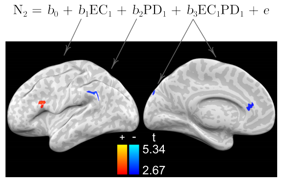
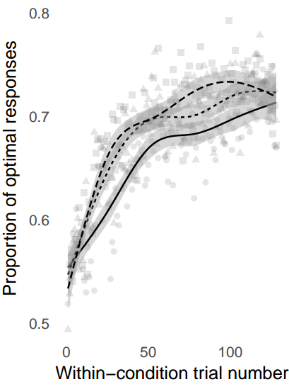
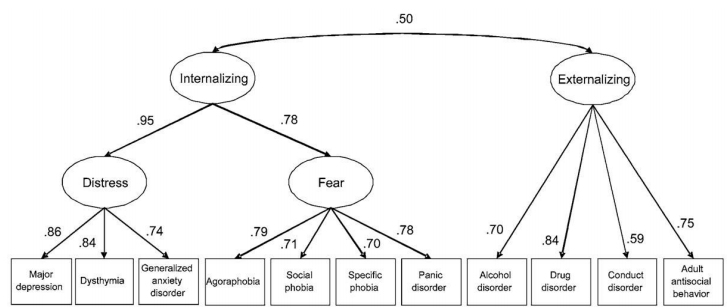
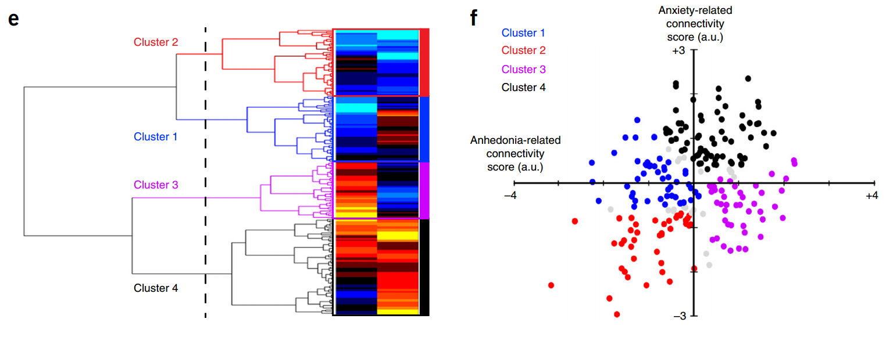
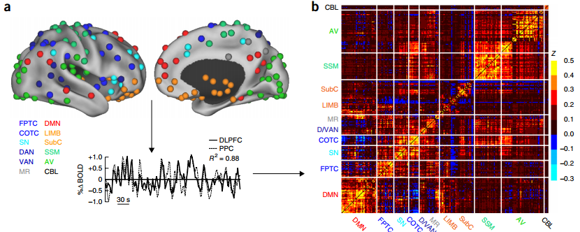
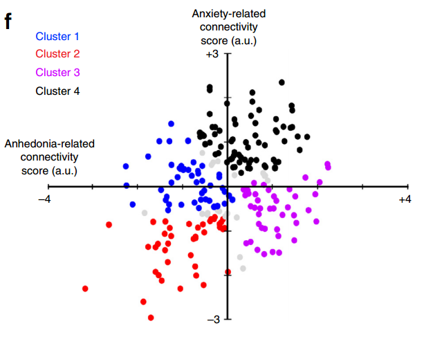
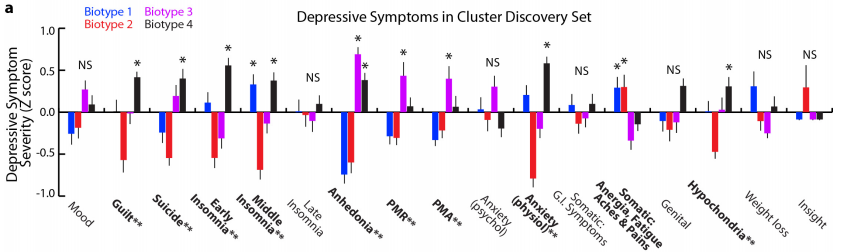
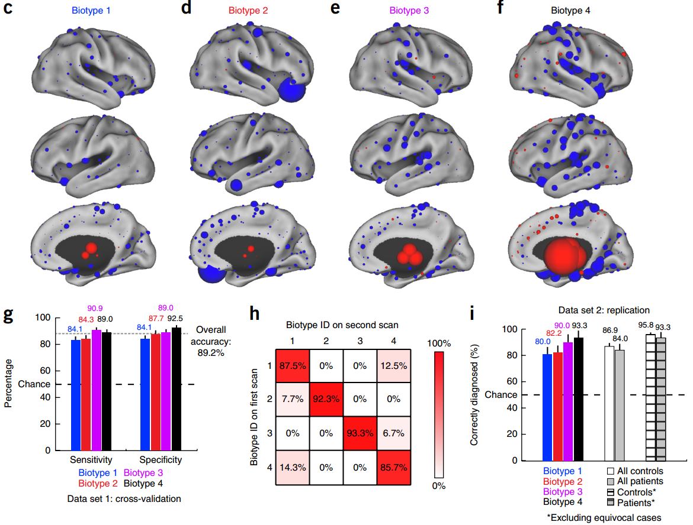

```{r setup, include=FALSE}
knitr::opts_chunk$set(echo = FALSE, warning = F, message = F, error = F)
```

# Origin story

## Where I started: What is the nature of reality?

_inspired by Nessa_

- Drilling into the micro with physics
- Decomposing consciousness
- Neuropharmacology of romantic love
- Understanding other minds
- Grad school! Social effects on decision making, motivation, learning
- **Application of psychological science to physical and mental health risks faced by adolescents.**

## What have I been working on?

- <div style = "float:left;width:30%;padding-right:1em">How adolescent development of empathy is related to prosocial behavior 

    </div>
- <div style = "float:left;width:30%;padding-right:1em">Lifespan development of personality & values 

    </div>
- <div style = "float:left;width:30%;padding-right:1em">Association between SES and temporal discounting 

    

    </div>

- and the diss...

## Measuring social motives via RL

- _Goal of research program:_ examine adolescent behavior through a functional lens 
    - Assume that behavior is in part directed toward satisfying developing social motivations for status and romantic relationships.
- _Problem:_ measuring motivations via a behavioral mechanism
- _Solution:_ describe how social content (related to implicit motives) potentiates reinforcement learning (via stimulus salience)
    - How does learning, and social potentiation of learning, differ across adolescent development?

## Social motives affect learning

 

## Learning improves through adolescence

 

## Learning potentiation is stable

 

## Decomposing using computational modeling

Potentiation due to learning rate, age effects due to increasing reponse to large rewards, increased attention

 

## Looking ahead...

1. How do daily emotional dynamics relate to stress and psychopathology symptoms?
2. **As children enter adolescence, can we identify who is at risk for psychopathology?**

# INTERMISSION

## Biotyping and prediction in Generation R

Collaborator: Henning Tiemeier, MA, MD, PhD; professor HSPH

The Generation R Study is a large, prospective population-based birth-cohort in which nearly 10,000 pregnant mothers were recruited between 2002 and 2006 with repeated measurements in the children and their parents over time.

- 3,439 9-to-11-year-old children w/rsfMRI (6 mins)
- CBCL from primary and secondary caregivers
- DISC-YC (218 w/a diagnosis, 460 dx ruled out)
- Stressful Life Events Questionnaire


## Biotypes and Prediction

Drysdale, A. T., Grosenick, L., Downar, J., Dunlop, K., Mansouri, F., Meng, Y., … Liston, C. (2016). Resting-state connectivity biomarkers define neurophysiological subtypes of depression. Nature Medicine, 23(1), 28–38. https://doi.org/10.1038/nm.4246

1. Clustering based on rsfMRI to define Biotypes
2. Predicting diagnostic category with rsfMRI (with the help of biotypes)

# Clustering patients into depression subtypes

**Why are there clusters in the first place? Do they vary by kind or continuous variation? Do these clusters appear in healthy populations as well? - Gina**

## Taxonomy versus Dimensionality

>A taxon is a nonarbitrary class whose existence is conjectured
as an empirical question, not a mere semantic convenience. Numerous taxa are
known to exist in nature and society.... What personality types, if any, occur in the nonpathological
population remains to be researched by sophisticated methods, and cannot be
settled by fiat or "dimensional" preference. The intuitive concept of taxonicity
is to be explicated by a combination of formal-numerical and causal criteria.
Taxometric methods should include consistency tests that provide Popperian
risk of strong discorroboration. (Meehl, 1992)

"Differences of kind rather than degree"

## Dimensional example

>[Dimensional models]...treat underlying liability as a continuous phenomenon, with individuals varying
along a continuous, graded range of liability to disorder. Another tractable possibility is to treat
the liabilities as discrete, with individuals being members of discrete classes or groups of
individuals. Under the former conceptualization, liability represents a continuum of risk to
disorder; under the latter conceptualization, liability represents types or categories of risk to
disorder. (Krueger & Markin, 2006) 

 Powerful for describing comorbidity

## Taxometric example

```{r echo = F, message = F, error = F, warning = F}
data(iris)
GGally::ggpairs(iris, columns = 1:4,
                diag = list(continuous=function(data,mapping,...) {
                  ggplot2::ggplot(data,mapping) +
                    ggplot2::geom_histogram(...)
                }), upper = list(continuous = 'blank'))
```

## Taxometric example

```{r echo = F, message = F, error = F, warning = F}
GGally::ggpairs(iris, mapping = ggplot2::aes(color = Species), columns = 1:4, 
                diag = list(continuous=function(data,mapping,...) {
                  ggplot2::ggplot(data,mapping) +
                    ggplot2::geom_histogram(ggplot2::aes(fill = Species), ...)
                }), upper = list(continuous = 'blank'))
```

## Clustering algorithms

Let's say we know there are 3 species, but we don't know which is which.

<div style = 'width:40%; float:right'>

```{r}
clusters <- hclust(dist(iris[, 1:4]))
clusterCut <- cutree(clusters, k = 3)
knitr::kable(table(clusterCut, iris$Species))
```

</div>

<div style = 'float:left; width = 40%'>

```{r fig.width = 6, fig.height=2.25, echo = F}
par(mar=c(0, 4, 4, 2))
plot(clusters, xlab = NA, sub = NA)
abline(a = 3.5, b = 0)
```
</div>

<br /><br />

- It's easy to separate Setosa, but not so much Versicolor & Virginica. Other choices of algorithm and variable-sets (I used all 4) produce better results.

## Drysdale et al's clustering



- Back to Gina's questions: 
    - Why would we expect people to be separable into subtypes? 
    - Why is this useful?

- What variables are they using as input to the cluster algorithm?
    - Canonical Variates

## Canonical Correlation Analysis

What is it?

- In regression, you want the linear combination of predictor variables, $X$, that gets you closest to your observed outcomes, $y$:

    $y = \beta_0 + \beta_1 \cdot x_1 + \beta_2 \cdot x_2 + ... + \beta_n \cdot x_n + \epsilon$

    In other words, we want to choose all the $\beta$s so that $\epsilon$ is as small as possible.

- If you have multiple $y$ variables, CCA does something like this _on both sides_\*:

    $\pi_1 \cdot y_1 + \pi_2 \cdot y_2 + ... + \pi_n \cdot y_n = \beta_1 \cdot x_1 + \beta_2 \cdot x_2 + ... + \beta_n \cdot x_n + \epsilon$

<div style='font-size: .5em'>\*_for conceptual purposes only_. Find a good geometric explanation  [here](https://stats.stackexchange.com/questions/65692/how-to-visualize-what-canonical-correlation-analysis-does-in-comparison-to-what), and mathy stuff [here](https://www.cs.cmu.edu/~tom/10701_sp11/slides/CCA_tutorial.pdf)</div>

## Canonical Variates

- You find the set of $\pi$ and $\beta$ coefficients so that when you do the math on both sides, the result is maximally correlated.
- For example, for 3 $x$ and 3 $y$ variables $V_y = p_1 \cdot y_1 + p_2\cdot y_2 + p_3\cdot y_3$, $V_x = b_1 \cdot x_1 + b_2\cdot x_2 + b_3\cdot x_3$, you want to set all the $p$s and $b$s so that you maximize the correlation between $V_y$ and $V_x$.
- $V_y$ and $V_x$ are now your first pair of *Cannonical Variates*.
- You can do this again to get another pair that isn't correlated to the first pair.

## Understanding how clustering inputs are constructed

For n = 220 diagnosed with depression (low comorbidity)

-  Resting state input: Select only those 33,154 correlations which were significantly ($\alpha = .005$) correlated with at least 1 of 17 HAMD-17 responses
- Depression symptom input: 17 HAMD-17 items
- CCA(selected rsfMRI, HAMD) produced 2 pairs of canonical variates

## Interpreting clusters

-  Clustering is done on two weighted sums of rsfMRI correlations that best approximate weighted sums of depression symptoms.
- Gina's final question: What would we expect from non-diagnosed participants? 

## Interpreting rsfMRI differences


## Looking toward Gen R

The plan is to proceed as in Drysdale...

1. May examine performance of different parcel-schemes
    - Power et al's spheres, but also Yeo, voxelwise, or other techniques
2. Define canonical variates based one
    - CBCL items, sub-factor (e.g., Fear, Dist, Ext) scores, or residuals after accounting for general P factor
3. Cluster based on
    - rsfMRI canonical variates, CBCL items (as comparison)
    - Cluster across heterogeneity

# Prediction

What do we mean by this word?


## Roughly two kinds

Important difference from association: You make a claim about an individual before you know the answer.

- Diagnostic: can I know something about an individual based on other characterstics
    - Can we figure out someone's mental health diagnostic status from rsfMRI
- Forecasting: can I know an individual's future state based on their state today
    - Can we tell if someone will develop psychopathology tomorrow based on everything we know about them today
- What does Drysdale do?

## What do we get from focusing on prediction?

- Well, we can predict things
- It's a severe metric for the presence of predictive information in our data+model
- Predictive performance is a very good common metric for comparing approaches
- With a decently sized sample, it gives you good information about what you might expect from a replication
- Further reading: Yarkoni & Westfall (2016) Choosing Prediction...

## What does this look like procedurally?

- Cross validated prediction means building a model (e.g., estimating regression coefficients) in one set of data...
- and then using that model (e.g., the estimated coefficients) to see how well they work with new data $X$ to predict $y$
- For predicting categories (diagnosed versus healthy control) your output is
    - Accuracy: how many true positives and true negatives as a proportion of all cases
    - Sensitivity: true positives out of all positives (correct detection without positive errors)
    - Specificity: true negatives out of all negatives (correct rejection without negative errors)
- What, actually, did they do?
- What could go wrong?
    
## How do Drysdale et al use prediction metrics?

Fig. 3 -- Train N = 711 (333 dx dep, 378 hc; 47%/53%), test N = 477 (125 dx dep, 352 hc; 26%/74%)



## for rTMS associaitons...

Fig. 4 -- Train N = 124 (70 responders, 54 non-responders; 56%/44%), test N = 30 (?, ?)


## Looking toward Gen R

- Use prediction to assess what inputs & psychopathology characterizations work best
- But what to predict?
    - Continuous CBCL symptoms
    - CBCL severity quantiles (top 20% v bottom 50%?)
    - DISC diagnosis in small subset

